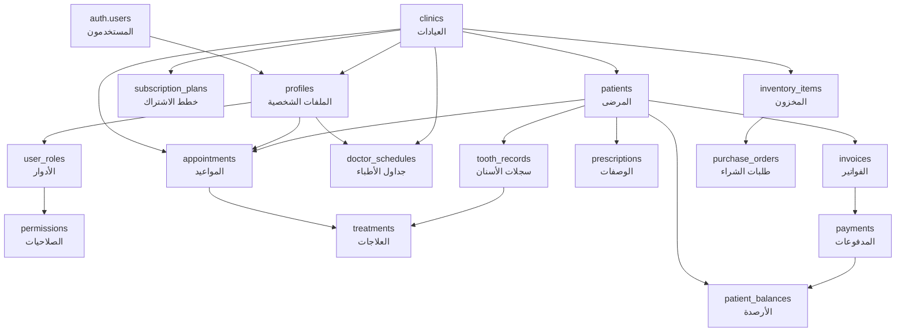

# 🔗 خريطة الترابط الرقمي لنظام UDent

## 🎯 العلاقات بين الجداول الرئيسية



---

## 🏗️ معمارية النظام متعددة الطبقات

```
┌─────────────────────────────────────────────────────────────────┐
│                    PRESENTATION LAYER (طبقة العرض)              │
│  ┌────────────┐  ┌────────────┐  ┌────────────┐  ┌──────────┐ │
│  │   Pages    │  │ Components │  │   Modals   │  │  Forms   │ │
│  │  (50+)     │  │  (200+)    │  │   (30+)    │  │  (40+)   │ │
│  └────────────┘  └────────────┘  └────────────┘  └──────────┘ │
└─────────────────────────────────────────────────────────────────┘
                              │
                              ▼
┌─────────────────────────────────────────────────────────────────┐
│               APPLICATION LAYER (طبقة التطبيق)                  │
│  ┌────────────┐  ┌────────────┐  ┌────────────┐  ┌──────────┐ │
│  │   Hooks    │  │  Contexts  │  │  Services  │  │  Utils   │ │
│  │   (64+)    │  │    (8)     │  │    (10+)   │  │  (20+)   │ │
│  └────────────┘  └────────────┘  └────────────┘  └──────────┘ │
└─────────────────────────────────────────────────────────────────┘
                              │
                              ▼
┌─────────────────────────────────────────────────────────────────┐
│              BUSINESS LOGIC LAYER (طبقة المنطق)                 │
│  ┌────────────┐  ┌────────────┐  ┌────────────┐  ┌──────────┐ │
│  │React Query │  │ Validation │  │  Caching   │  │  State   │ │
│  │            │  │            │  │            │  │Management│ │
│  └────────────┘  └────────────┘  └────────────┘  └──────────┘ │
└─────────────────────────────────────────────────────────────────┘
                              │
                              ▼
┌─────────────────────────────────────────────────────────────────┐
│                 DATA ACCESS LAYER (طبقة البيانات)              │
│  ┌────────────┐  ┌────────────┐  ┌────────────┐  ┌──────────┐ │
│  │  Supabase  │  │   RLS      │  │  Triggers  │  │Functions │ │
│  │   Client   │  │  Policies  │  │            │  │          │ │
│  └────────────┘  └────────────┘  └────────────┘  └──────────┘ │
└─────────────────────────────────────────────────────────────────┘
                              │
                              ▼
┌─────────────────────────────────────────────────────────────────┐
│              DATABASE LAYER (طبقة قاعدة البيانات)              │
│  ┌────────────┐  ┌────────────┐  ┌────────────┐  ┌──────────┐ │
│  │PostgreSQL  │  │  Storage   │  │  Realtime  │  │  Edge    │ │
│  │  (120+)    │  │            │  │            │  │Functions │ │
│  └────────────┘  └────────────┘  └────────────┘  └──────────┘ │
└─────────────────────────────────────────────────────────────────┘
```

---

## 🔄 تدفق البيانات في سيناريوهات مختلفة

### سيناريو 1: تسجيل مريض جديد

```
🙋 User Action: يضغط على "إضافة مريض"
     ↓
📝 UI: يفتح AddPatientDrawer
     ↓
✍️ Form: يدخل بيانات المريض
     ↓
✅ Validation: التحقق من البيانات (Zod/React Hook Form)
     ↓
🔄 Hook: useCreatePatient.mutate()
     ↓
📡 API: supabase.from('patients').insert()
     ↓
🔒 RLS: التحقق من صلاحيات clinic_id
     ↓
💾 Database: INSERT INTO patients
     ↓
⚡ Trigger: تحديث created_by, audit_trail
     ↓
📤 Response: { data, error }
     ↓
🔄 Cache: React Query invalidates & refetches
     ↓
🎉 UI: Toast success + Close drawer + Update list
```

### سيناريو 2: حجز موعد

```
📅 User: يختار تاريخ ووقت
     ↓
🔍 Check: getAvailableTimeSlots()
     │
     ├─→ 📊 Query: doctor_schedules (جدول الطبيب)
     ├─→ 📊 Query: appointments (المواعيد الموجودة)
     └─→ 🧮 Calculate: الأوقات المتاحة
     ↓
✅ Validate: هل الوقت متاح؟
     ↓
💾 Insert: appointments table
     │
     ├─→ 🔗 Link: patient_id
     ├─→ 🔗 Link: doctor_id
     ├─→ 🔗 Link: clinic_id
     └─→ ⚡ Trigger: إرسال إشعار
     ↓
📧 Notification: SMS/Email للمريض والطبيب
     ↓
🎉 Success: تأكيد الحجز
```

### سيناريو 3: إصدار فاتورة

```
💰 User: يضيف خدمات للفاتورة
     ↓
🧮 Calculate: 
     │
     ├─→ مجموع الخدمات
     ├─→ الخصومات
     ├─→ الضرائب
     └─→ الإجمالي
     ↓
💾 Create Invoice:
     │
     ├─→ 📄 invoices table
     ├─→ 📋 invoice_items table
     └─→ 💵 patient_balances (تحديث الرصيد)
     ↓
🔒 Transaction: BEGIN ... COMMIT
     ↓
📊 Update: 
     │
     ├─→ patient.total_balance
     ├─→ clinic.monthly_revenue
     └─→ financial_reports
     ↓
🎉 Success: طباعة الفاتورة
```

---

## 🔐 نظام الصلاحيات (RLS + Permissions)

```
User Login
    ↓
Get User Profile
    ↓
Get User Roles
    │
    ├─→ owner (مالك)
    ├─→ dentist (طبيب)
    ├─→ assistant (مساعد)
    ├─→ accountant (محاسب)
    └─→ secretary (سكرتير)
    ↓
Load Role Permissions
    │
    ├─→ patients (عرض، إضافة، تعديل، حذف)
    ├─→ appointments (عرض، حجز، إلغاء)
    ├─→ treatments (عرض، إضافة، تعديل)
    ├─→ financial (عرض، فواتير، مدفوعات)
    ├─→ reports (عرض، تصدير)
    └─→ settings (عرض، تعديل)
    ↓
Apply RLS Policies
    │
    ├─→ clinic_id = user.clinic_id
    ├─→ created_by = user.id (للبيانات الخاصة)
    └─→ is_visible = true
    ↓
Filter UI Components
    │
    ├─→ Show/Hide buttons
    ├─→ Enable/Disable features
    └─→ Restrict access to pages
```

---

## 📊 نقاط الاتصال الحرجة

### 1️⃣ Authentication Flow
```
Login Page
    ↓
supabase.auth.signInWithPassword()
    ↓
JWT Token Generated
    ↓
Store in localStorage
    ↓
Auto-refresh every 55 minutes
    ↓
On expiry: Logout
```

### 2️⃣ Data Sync Flow
```
Component Mount
    ↓
useQuery Hook
    ↓
Check Cache
    │
    ├─→ Hit: Return cached data
    └─→ Miss: Fetch from API
         ↓
    supabase.from('table').select()
         ↓
    RLS Check
         ↓
    Return filtered data
         ↓
    Cache for 3 minutes
         ↓
    Auto-refresh in background
```

### 3️⃣ Real-time Updates
```
Subscribe to table
    ↓
supabase.channel('table-changes')
    ↓
Listen to INSERT/UPDATE/DELETE
    ↓
Filter by clinic_id
    ↓
Trigger cache invalidation
    ↓
UI auto-updates
```

---

## 🧩 الوحدات المترابطة

### Module 1: Patient Management
```
Components:
  ├─ PatientList
  ├─ PatientCard
  ├─ AddPatientDrawer
  └─ PatientProfile

Hooks:
  ├─ usePatients
  ├─ useCreatePatient
  ├─ useUpdatePatient
  └─ useDeletePatient

Database:
  ├─ patients
  ├─ patient_medical_history
  ├─ patient_medications
  └─ patient_files
```

### Module 2: Appointment System
```
Components:
  ├─ AppointmentList
  ├─ CalendarView
  ├─ NewAppointmentForm
  └─ DayDetailModal

Hooks:
  ├─ useAppointments
  ├─ useAvailableSlots
  └─ useDoctorSchedules

Services:
  └─ AppointmentService

Database:
  ├─ appointments
  ├─ doctor_schedules
  ├─ appointment_requests
  └─ notifications
```

### Module 3: Dental Chart
```
Components:
  ├─ Enhanced2DToothChart
  ├─ ToothModal
  ├─ DentalTreatmentForm
  └─ OralHealthDashboard

Hooks:
  ├─ useDentalChart
  └─ useDentalChartEnhanced

Database:
  ├─ tooth_records
  ├─ tooth_surfaces
  ├─ tooth_treatments
  ├─ tooth_images
  └─ diagnosis_templates
```

### Module 4: Financial Management
```
Components:
  ├─ Invoices
  ├─ Payments
  ├─ PatientFinancialStatus
  └─ FinancialReports

Hooks:
  ├─ useInvoices
  ├─ usePayments
  └─ usePatientFinancials

Database:
  ├─ invoices
  ├─ invoice_items
  ├─ payments
  └─ patient_balances
```

---

## 🔗 External Integrations

```
UDent System
    │
    ├─→ 📧 Email (Future)
    │    └─ Notification emails
    │
    ├─→ 📱 SMS (Future)
    │    └─ Appointment reminders
    │
    ├─→ 💳 Payment Gateway (Future)
    │    └─ Moyasar, Tap, Hyperpay
    │
    ├─→ 📊 Analytics (Recommended)
    │    └─ Google Analytics
    │
    ├─→ 🔍 Monitoring (Recommended)
    │    └─ Sentry, LogRocket
    │
    └─→ 🔌 API (Now Available!)
         ├─ RESTful API
         ├─ Webhooks
         └─ API Keys Management
```

---

## ⚡ Performance Optimization Points

### 1. Database Level
```sql
-- Indexes على الأعمدة المستخدمة بكثرة
CREATE INDEX idx_patients_clinic_id ON patients(clinic_id);
CREATE INDEX idx_appointments_date ON appointments(appointment_date);
CREATE INDEX idx_appointments_doctor ON appointments(doctor_id);

-- Materialized Views للتقارير
CREATE MATERIALIZED VIEW monthly_stats AS
SELECT ... FROM patients, appointments ...
```

### 2. Application Level
```typescript
// React Query caching
staleTime: 3 * 60 * 1000, // 3 minutes
gcTime: 15 * 60 * 1000, // 15 minutes

// Virtual scrolling للقوائم الطويلة
<VirtualizedPatientList />

// Lazy loading للصفحات
const Settings = lazy(() => import('@/pages/Settings'));
```

### 3. Network Level
```typescript
// Batch requests
const [patients, appointments] = await Promise.all([
  fetchPatients(),
  fetchAppointments()
]);

// Debounce search
const debouncedSearch = useDebounce(searchTerm, 500);
```

---

## 🎯 الخلاصة

النظام مبني على **معمارية متينة** تعتمد على:

✅ **Separation of Concerns** - فصل واضح بين الطبقات  
✅ **Single Source of Truth** - قاعدة بيانات مركزية  
✅ **Real-time Sync** - تزامن فوري  
✅ **Type Safety** - TypeScript في كل مكان  
✅ **Scalable Architecture** - قابل للتوسع  
✅ **Security First** - الأمان أولوية  

**الترابط الرقمي: 🟢 ممتاز (95%)**

---
